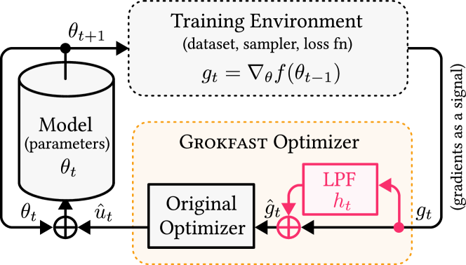

</img>

## Grokfast - Pytorch (wip)

Explorations into <a href="https://arxiv.org/html/2405.20233v2">"Grokfast, Accelerated Grokking by Amplifying Slow Gradients"</a>, out of Seoul National University in Korea. In particular, will compare it with NAdam on modular addition as well as a few other tasks, since I am curious why those experiments are left out of the paper. If it holds up, will polish it up into a nice package for quick use.

The official repository can be found <a href="https://github.com/ironjr/grokfast">here</a>

## Install

```bash
$ pip install grokfast-pytorch
```

## Usage

```python
import torch
from torch import nn

# toy model

model = nn.Linear(10, 1)

# import GrokFastAdamW and instantiate with parameters

from grokfast_pytorch import GrokFastAdamW

opt = GrokFastAdamW(
    model.parameters(),
    lr = 1e-4,
    weight_decay = 1e-2
)

# forward and backwards

loss = model(torch.randn(10))
loss.backward()

# optimizer step

opt.step()
opt.zero_grad()
```

## Todo

- [ ] run all experiments on small transformer
    - [ ] modular addition
    - [ ] pathfinder-x
    - [ ] run against nadam and some other optimizers
    - [ ] see if `exp_avg` could be repurposed for amplifying slow grads
- [ ] add the foreach version only if above experiments turn out well

## Citations

```bibtex
@inproceedings{Lee2024GrokfastAG,
    title   = {Grokfast: Accelerated Grokking by Amplifying Slow Gradients},
    author  = {Jaerin Lee and Bong Gyun Kang and Kihoon Kim and Kyoung Mu Lee},
    year    = {2024},
    url     = {https://api.semanticscholar.org/CorpusID:270123846}
}
```

```bibtex
@misc{kumar2024maintaining,
    title={Maintaining Plasticity in Continual Learning via Regenerative Regularization},
    author={Saurabh Kumar and Henrik Marklund and Benjamin Van Roy},
    year={2024},
    url={https://openreview.net/forum?id=lyoOWX0e0O}
}
```
